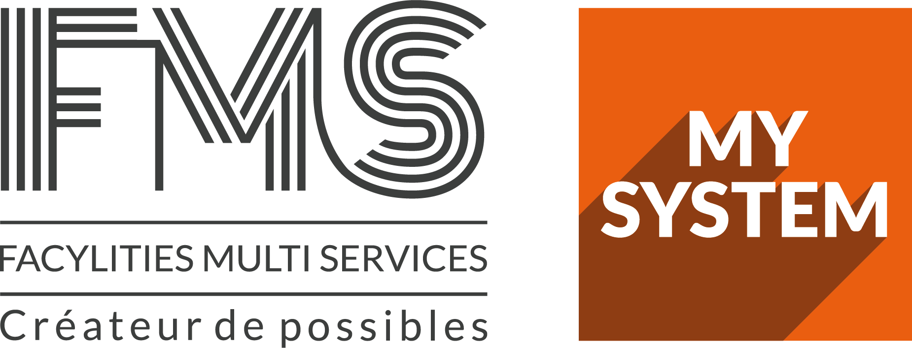

    

    <a href="https://fms-ea.com//">FMS</a>

    <em>« Se réunir est un début, rester ensemble est un progrès, travailler ensemble est la réussite »</em>

    

L'objectif est de mutaliser et de partager les connaissances des uns et des autres au travers de ce dépôt GitHub et de constituer des *Chapters*[^1] et des  *Guilds*[^2] autour de différents thèmes. 

[Code de conduite](CODE_OF_CONDUCT.md)

[Comment contribuer](CONTRIBUTING.md)

[Guide de démarrage](GETTING_STARTED.md)

[Ressources](./Ressources/README.md)

[^1]: un groupe de personnes ayant des compétences similaires et travaillant dans le même domaine de compétence général. Cf. <a href="https://blog.crisp.se/wp-content/uploads/2012/11/SpotifyScaling.pdf" alt="Scaling Agile @Spotify">Scaling Agile @Spotify</a>

[^2]: Un groupe de personnes plus large qui souhaite partager connaissances, outils, code et pratiques. Cf. <a href="https://blog.crisp.se/wp-content/uploads/2012/11/SpotifyScaling.pdf" alt="Scaling Agile @Spotify">Scaling Agile @Spotify</a>
