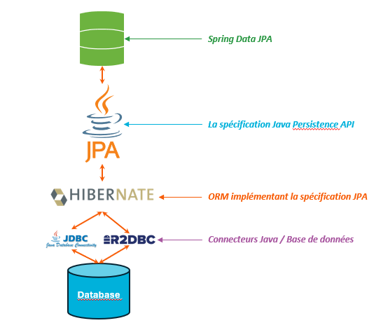

# Auditing & SoftDelete

## Définitions

### Auditing

*Spring Data offre une prise en charge avancée permettant de suivre de manière transparente qui a créé ou modifié une entité, ainsi que le moment où la modification a eu lieu.*

### Soft Delete

*Il arrive parfois que l’on ait besoin de ne jamais supprimer physiquement des lignes de la base de données, mais plutôt d’effectuer une « suppression logique » (soft delete), consistant à mettre à jour une colonne afin d’indiquer que la ligne n’est plus active.*

## Rappels

### Articulation Spring Data (JPA) / JPA / Hibernate

*Spring data JPA* est bati par dessus la spécificatiopn JPA. 

L'ORM *Hibernate* est l'implémentation - de référence - de *Java Persistence API (JPA)*, et est utilisé par défaut lorsque vous utilisez *Spring Data JPA*. Mais il existe d'autres ORM...

Les connecteurs *Java DataBase Connectivity (JDBC)* et *Reactive Relational DataBase Connectivity (R2DBC)* font le lien entre les applications Java et les bases de données.

### Références

- Java persistence API  

- Hibernate pour Spring Boot v4.0 

- Spring Data JPA pour Spring Boot v4.0 

## Nouveautés

Hibernate a introduit depuis la version 7 une nouvelle option de stratégie pour la gestion de la suppression logique, basée sur une colonne de type Timestamp

Changement par rapport à Spring Boot 3.5 : 

- **changement de stratégie** sur le *@SoftDelete* -> **strategy.TIMESTAMP**

- **suppression du convertisseur** devenu inutile 

